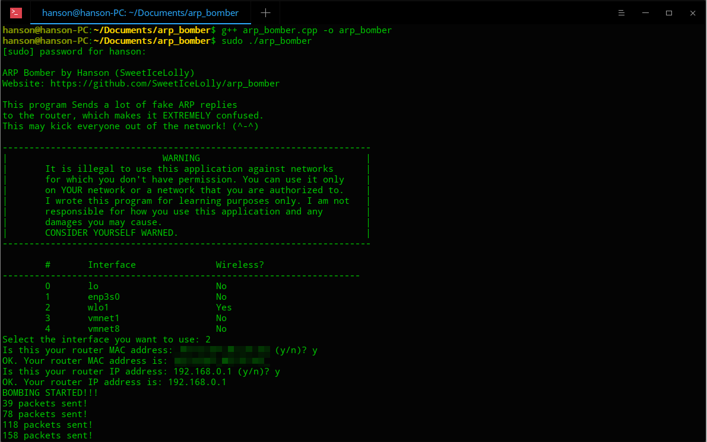
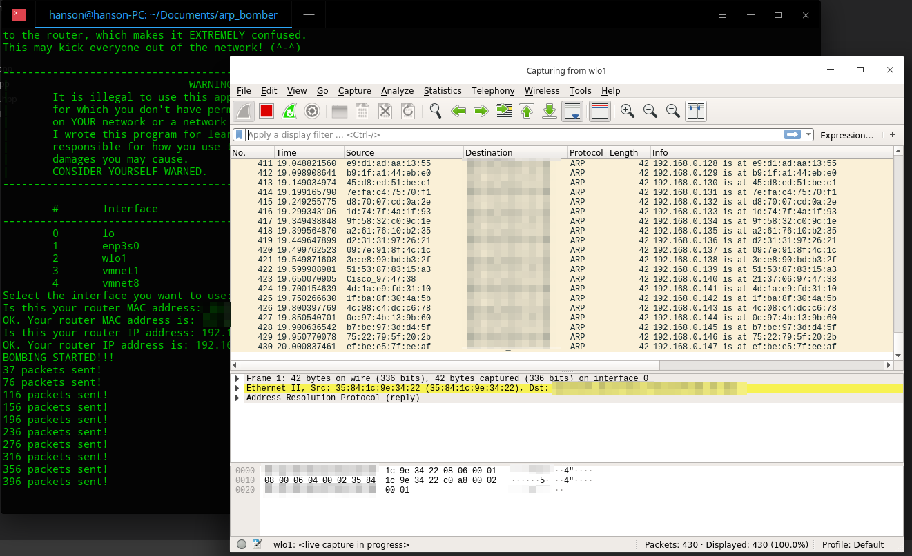

# ARP Bomber
This program sends a lot of fake ARP packets to the router, which makes it EXTREMELY confused. This may kick everyone out of the network! (^-^)

## WARNING
It is illegal to use this application against networks for which you don't have permission. You can use it only on __YOUR__ network or a network that you are authorized to. I wrote this program for learning purposes only. I am not responsible for how you use this application and any damages you may cause.

CONSIDER YOURSELF WARNED.

## Story
Actually, at first, I wanted to write a program that prevents MITM (Man-in-the-middle) attack by sending ARP packets to current machine, but I failed to do that. The program did not work as I expected and it fails to prevent MITM attacks. However, I DID successfully send ARP packets. Then I came up with a _interesting_ idea: what will happen if I send a lot of fake ARP reply packets to the router? I can send replies to the router on behalf of different clients, and tell the router that the device is at another MAC address (e.g. Router receives ARP reply: 192.168.168.3 is at aa:bb:cc:dd:ee:ff). Will the router trust in my fake packets? So I wrote this program. The test result is fully unexpected for me - the router DID trust my packets, and all wireless devices disconnected from the router! The disconnected devices were not able to connect to the WiFi network until the attack stops: just like deauthentication attacks! So, I implemented some details of this program and decided to make it open-source.

## Compile
Platform: linux

Command: `g++ arp_bomber.cpp -o arp_bomber`

## License
MIT License. Please see [LICENSE](LICENSE)

# ARP 轰炸机
本程序发送大量的虚假ARP数据包给路由器，让它非常混乱。这可能可以把所有人都踢出网络！ (^-^)

## 警告
在您没有权限的网络上使用本程序是非法的。您只能在您自己的或者您被授权的网络上使用本程序。我编写本程序只是为了学习用途。我对您使用本程序的方式以及可能导致的任何后果概不负责。

你已经被警告了。

## 故事
实际上，一开始我是想写一个通过往自己的机器发送ARP数据包来防止MITM(中间人攻击)的程序的，但是我没成功。那个程序并没有像我想象的那样能够防护MITM攻击，但是我却成功地发送了ARP数据包。然后我就萌生了一个 _有趣的_ 想法：要是我把大量的虚假ARP回复数据包发给路由器会发生什么呢？我可以以其他机器的名义给路由器发送回复，并告诉路由器这个机器在别的MAC地址上（例如: 路由器接收到ARP回复： 192.168.168.3 在 aa:bb:cc:dd:ee:ff上）。路由器会不会相信我发的数据包呢？所以我就写了这个程序。测试的结果完全出乎我的意料 —— 路由器确实相信了我的数据包，并且所有无线设备都断开了连接！所有断开了的设备都无法重新连上WiFi，直到攻击停止：就像是取消验证(deauthentication)攻击一样。所以，我把本程序的一些细节完善了，并决定开源。

## 编译
平台: linux

命令： `g++ arp_bomber.cpp -o arp_bomber`

## 开源协议
MIT协议。请见 [LICENSE](LICENSE)

# Captures / 截图

 User Interface / 用户界面 

 Wireshark Capture / Wireshark 抓包 
